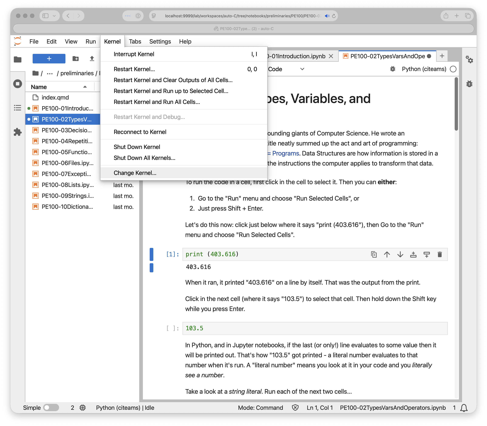

# A Docker recipe that allows you to test the training notebooks in a container via JupyterLab

This docker image is a Debian based image based on miniconda that has the following installed and configured

- JupyterLab
- mini conda
- CITEAMS conda environment for python dependencies

## Basic scripts and files


**Dockerfile** Dockerfile used to prepare this container

**docker_build.sh** A wrapper script that builds an image for your local user. The image will be named citeams/training:latest . 

**docker_run.sh** A wrapper script that starts the built container using docker-run command.

**config/conda.yml** Lists explicitly what python libraries are installed for the notebooks.


## Prerequisites

- Install Docker on your local machine (https://docs.docker.com/get-docker/)


Step 1: Build a new docker image using the recipe
-------------------------------------------------
```
./docker_build.sh
```


Step 2: Start the Docker container
----------------------------------

```
./docker_run.sh
```

Step 3: Running the notebooks
-----------------------------

Navigate to  `http://localhost:9999/lab` in your web browser

It will ask for a token. The token will be displayed on the command line when you run the ./docker_run.sh file

```
./docker_run.sh
...
# below is an example output
 Or copy and paste one of these URLs:
        http://e2f6dea90de3:8888/lab?token=f12b2c9c1c682d96c89f189cf3f2e70adbeeebb39fab9d8c
```

**Note:** you copy the token value as you see in your terminal.

One thing to ensure is that when running the notebook, you have to explicity use the
citeams kernel. The snapshot below shows that

